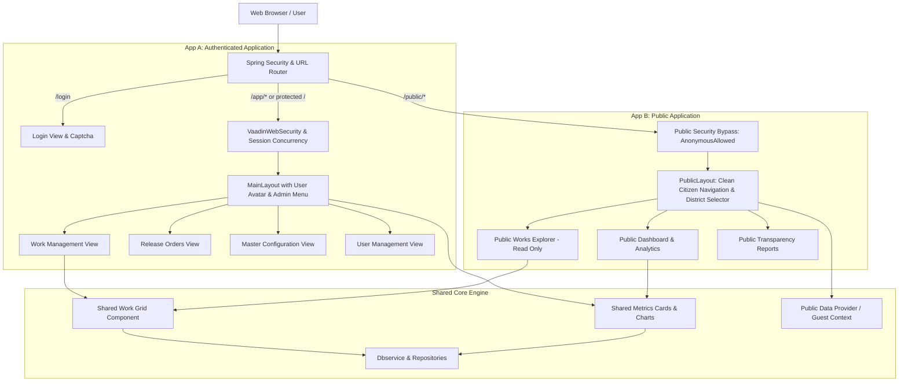

# SMIS 2.0: Codebase Audit & Dual-App Architecture Plan

---

## 1. Executive Summary & Codebase Audit

### 1.1 Technology Stack Identified
| Layer | Technology | Details / Version |
| :--- | :--- | :--- |
| **Backend Framework** | Spring Boot | `3.1.5` (Java 17, Jakarta EE 10 / Servlet 5.0) |
| **Packaging** | WAR | Executable Spring Boot JAR/WAR (`com.application.smis:smis:2.0`) |
| **Frontend Framework** | Vaadin Flow | `24.2.0` (Java server-side UI, Vite `4.4.11`, Lit, Lumo design system) |
| **Security Layer** | Spring Security | `6.1.5` integrated via `VaadinWebSecurity`, BCrypt, Session concurrency controls |
| **Database & ORM** | PostgreSQL + JPA | Hibernate 6.2, PostgreSQL dialect, `spring-boot-starter-data-jpa` |
| **Reporting Engine** | JasperReports | `6.20.6` (Jasper Reports + Liberation Fonts) |
| **Charts & Visuals** | SO-Charts | `3.2.4` (Apache ECharts Java wrapper for Vaadin) |
| **Security Add-ons** | OWASP Sanitizer & Bucket4j | OWASP Java HTML Sanitizer `20260313.1`, Bucket4j `8.1.0` |

---

### 1.2 Authentication & Security Audit Status
- **Current State:** **Authentication is already fully configured and enforced.**
  - `SecurityConfiguration.java` extends `com.vaadin.flow.spring.security.VaadinWebSecurity`.
  - Authentication flow uses a custom `Login.java` view mapped to route `@Route("login")` annotated with `@AnonymousAllowed`.
  - Passwords are encrypted using `BCryptPasswordEncoder`.
  - Strict session concurrency is enforced: `ConcurrentSessionControlAuthenticationStrategy` allows **only 1 session per user** (`maxSessionsPreventsLogin = true`).
  - Security headers are applied: Custom Content Security Policy (`SecurityHeadersPolicy.CSP`), `X-Frame-Options: DENY`, `HSTS` (1 year), and Permissions-Policy.
  - HTTP methods like `OPTIONS`, `DELETE`, `PATCH`, `PUT` are rejected by `disableOptionsMethodFilter`.
  - Existing local test bypass: An existing profile `no-auth-test` uses `NoAuthTestAuthenticationFilter` to auto-log in as the first enabled `SUPER` user.

---

### 1.3 Critical Architectural Bottlenecks for a Public (Unauthenticated) App
1. **Hardcoded User Retrieval in `MainLayout`:**
   - In `MainLayout.java` (lines 96-104 and 166), the layout constructor immediately invokes:
     ```java
     user = service.getLoggedUser();
     LocalDate expiryDate = user.getPwdChangedDate();
     H3 logo = new H3("SMIS 2.0 || " + service.getDistrict().getDistrictName().toUpperCase());
     ```
   - If an unauthenticated user hits any view using `MainLayout`, `service.getLoggedUser()` yields `null`, immediately triggering a `NullPointerException` (500 Error).
2. **Hardcoded District Scoping:**
   - Database queries throughout `Dbservice` filter by `service.getLoggedUser().getDistrict()`. Unauthenticated users have no assigned district and need statewide aggregation or a public district selector.
3. **Strict Route Permissions:**
   - Every view except `Login.java` is guarded with `@PermitAll` or `@RolesAllowed({"USER", "ADMIN", "SUPER"})`. Vaadin Flow's `AccessAnnotationChecker` redirects anonymous visitors to `/login`.
4. **Session Concurrency Lock:**
   - Global `maximumSessions(1)` would break public guest access if anonymous guests shared any dummy authenticated principal.

---

## 2. Dual-App Architectural Blueprint

To satisfy both entry points cleanly without code duplication, we establish a **Dual-Portal Architecture**:
- **App A (Authenticated Admin Portal):** Full operational access for departmental users (`SUPER`, `ADMIN`, `USER`).
- **App B (Public Transparency Portal):** Open, guest-friendly, read-only access for citizens and public viewers.



---

## 3. App A: Authenticated App (With Login)

### 3.1 Purpose & Role
Dedicated portal for government officials, district officers, and system administrators to enter, approve, configure, and print scheme release orders.

### 3.2 Exact Routes & Roles
| Route | View Class | Layout | Allowed Roles | Description |
| :--- | :--- | :--- | :--- | :--- |
| `/login` | `Login.java` | *None* | Anonymous | Form credentials, Captcha, Base64 transmission, audit log |
| `/` | `HomeView.java` | `MainLayout` | `@PermitAll` | Authenticated district dashboard & SO-Charts |
| `mlaschemes` | `WorkView.java` | `MainLayout` | `USER`, `ADMIN`, `SUPER` | MLA scheme data entry, edit form, validation |
| `mpschemes` | `WorkMpView.java` | `MainLayout` | `USER`, `ADMIN`, `SUPER` | MP scheme data entry & updates |
| `releaseordermla` | `PrintView.java` | `MainLayout` | `USER`, `ADMIN`, `SUPER` | Generate and export JasperReports release orders |
| `releaseordermp` | `PrintViewMp.java` | `MainLayout` | `USER`, `SUPER` | MP release order printing |
| `printing` | `ReportView.java` | `MainLayout` | `@PermitAll` | Report generation and export center |
| `mlamaster` | `MasterView.java` | `MainLayout` | `ADMIN`, `SUPER` | Constituency, scheme, and block configurations |
| `master` | `SuperMasterView.java` | `MainLayout` | `SUPER` | Super admin system parameters |
| `districtmaster`| `DistView.java` | `MainLayout` | `SUPER` | District & State master tables |
| `users` | `UsersView.java` | `MainLayout` | `ADMIN`, `SUPER` | User provisioning, password resets, role grants |
| `audittrail` | `AuditView.java` | `MainLayout` | `ADMIN`, `SUPER` | System access and security audit logs |

### 3.3 Security, Filters & Session Management
1. **Authentication Filter:** Uses standard Spring Security username/password authentication processed through `AuthenticationManager` and `UserDetailsServiceImpl`.
2. **Single-Session Enforcement:** Kept active for App A. Prevents credential sharing across district offices (`maximumSessions(1)`).
3. **Password Expiry & Hygiene:** 180-day password expiration prompt enforced via `MainLayout.checkPasswordExpiry()`.
4. **Audit Logging:** Every successful and failed login is logged via `Audit.saveLoginAudit()` to table `AuditTrail`.

---

## 4. App B: Public App (Without Login)

### 4.1 Purpose & Role
Direct-access citizen transparency portal. Bypasses authentication completely, presents statewide and district-level statistics, approved schemes, and public release order information in read-only mode without login prompts.

### 4.2 Exact Routes & Views
| Route | View Class | Layout | Security Annotation | Functionality |
| :--- | :--- | :--- | :--- | :--- |
| `public` | `PublicHomeView.java` | `PublicLayout` | `@AnonymousAllowed` | Public dashboard: total works, expenditure summary, interactive SO-Charts |
| `public/works` | `PublicWorksView.java` | `PublicLayout` | `@AnonymousAllowed` | Citizen work search: filter by district, constituency, scheme, year |
| `public/reports`| `PublicReportsView.java`| `PublicLayout` | `@AnonymousAllowed` | View and download approved public summary reports |
| `public/about` | `PublicAboutView.java` | `PublicLayout` | `@AnonymousAllowed` | Scheme guidelines, department contact details, disclaimer |

### 4.3 Layout & Guest State Architecture
1. **Dedicated Layout (`PublicLayout.java`):**
   - No `service.getLoggedUser()` calls.
   - Clean top navigation bar featuring Government of Meghalaya branding.
   - District Selector ComboBox: Allows citizens to select any district (defaults to "All Districts / Statewide").
   - "Officer Login" button in header linking directly to `/login`.
2. **Security Bypass Configuration:**
   - In `SecurityConfiguration.java`:
     ```java
     http.authorizeHttpRequests(authorize -> authorize
         .requestMatchers(new AntPathRequestMatcher("/public/**")).permitAll()
         .requestMatchers(new AntPathRequestMatcher("/images/**")).permitAll()
         .requestMatchers(new AntPathRequestMatcher("/icons/**")).permitAll()
     );
     ```
   - Vaadin views under `com.smis.view.publicportal.*` use `@AnonymousAllowed`.
3. **Guest Data & State Handling:**
   - No mock credentials required in the database.
   - Introduce a `PublicDataService`:
     - Queries existing repositories directly with public-safe projections.
     - Supports statewide aggregation (e.g., `workRepository.findAll()`) or filtering by the public district selected in the UI.
     - Strips sensitive metadata (e.g., internal user notes, audit IDs, phone numbers).
   - Forms and editing controls (save, edit, delete, release action buttons) are completely omitted.

---

## 5. Shared Components, Services & Models

To avoid code duplication between both applications, shared elements will be structured into modular packages:

```
src/main/java/com/smis/
├── entity/                     <-- [SHARED] JPA Entities (Work, District, Constituency, etc.)
├── repository/                 <-- [SHARED] Spring Data Repositories
├── dbservice/
│   ├── Dbservice.java          <-- [SHARED / APP A] Core DB service for authenticated operations
│   ├── DashboardService.java   <-- [SHARED] Dashboard metrics & counts
│   └── PublicDataService.java  <-- [APP B] Read-only, guest-safe aggregation queries
├── components/
│   ├── common/
│   │   ├── MetricCardsLayout.java    <-- [SHARED] Reusable 4-card summary widgets
│   │   └── SchemeChartsLayout.java   <-- [SHARED] Reusable SO-Charts constituency graph
│   └── grid/
│       └── WorksDisplayGrid.java     <-- [SHARED] Grid displaying works (read-only vs editable mode)
├── view/
│   ├── MainLayout.java         <-- [APP A] Authenticated layout with profile & admin menu
│   ├── ... (App A Views)
│   └── publicportal/
│       ├── PublicLayout.java   <-- [APP B] Unauthenticated citizen portal layout
│       ├── PublicHomeView.java <-- [APP B] Public dashboard
│       └── PublicWorksView.java<-- [APP B] Public works search
└── security/                   <-- Spring Security, filters, login handlers
```

---

## 6. Terminal & Execution Strategy

You can build, test, and run the project locally using either a single unified application running both portals or two distinct runtime profiles.

### 6.1 Building & Compiling
```powershell
# Clean compile and prepare frontend bundle
.\mvnw.cmd clean compile

# Full package build (WAR file creation)
.\mvnw.cmd package -DskipTests
```

---

### 6.2 Running Locally

#### Strategy 1: Unified Dual-Portal (Default Recommended)
Both applications run together in one JVM instance on port `8080`:
- **App A (Authenticated):** Open `http://localhost:8080/` (redirects to `/login`)
- **App B (Public Guest):** Open `http://localhost:8080/public`

```powershell
# Standard run
.\mvnw.cmd spring-boot:run
```

---

#### Strategy 2: Dedicated Runtime Profiles (Separate Ports)
Run App A and App B on independent ports for isolated local testing or separate deployment instances:

1. **Run App A (Authenticated App on Port 8080):**
   ```powershell
   .\mvnw.cmd spring-boot:run -Dspring-boot.run.arguments="--server.port=8080 --app.mode=authenticated"
   ```

2. **Run App B (Public Guest App on Port 8081):**
   ```powershell
   .\mvnw.cmd spring-boot:run -Dspring-boot.run.arguments="--server.port=8081 --app.mode=public"
   ```

---

#### Strategy 3: Existing Dev Bypass Profile (`no-auth-test`)
For local developer testing of admin screens without typing credentials:
```powershell
.\mvnw.cmd spring-boot:run -Dspring-boot.run.profiles=no-auth-test
```

---

## 7. Step-by-Step Implementation Roadmap

| Phase | Milestone | Deliverables |
| :--- | :--- | :--- |
| **Phase 1: Shared UI Extraction** | Component decoupling | Extract `MetricCardsLayout` and `WorksDisplayGrid` into `com.smis.components` |
| **Phase 2: Public Data Service** | Safe data layer | Create `PublicDataService` for null-safe, unauthenticated queries & aggregations |
| **Phase 3: Public Layout & Views** | App B views | Implement `PublicLayout`, `PublicHomeView`, `PublicWorksView`, `PublicReportsView` with `@AnonymousAllowed` |
| **Phase 4: Security Rule Updates** | Route authorization | Update `SecurityConfiguration.java` to whitelist `/public/**` and allow anonymous routing |
| **Phase 5: Verification & Testing**| Quality assurance | Unit test guest access, verify App A login enforcement, and verify zero NPEs on unauthenticated browsing |
